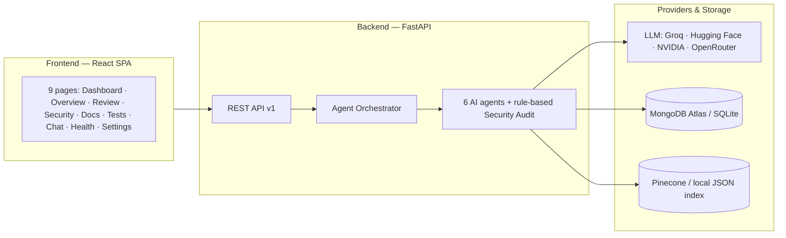
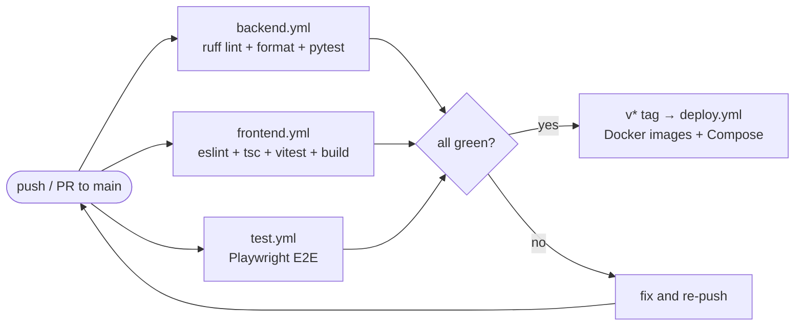

# DevPilot AI

**AI Powered Developer Productivity Platform**

DevPilot AI is a modular, production-grade SaaS platform that helps engineering teams analyze repositories, review code, generate documentation and tests, chat with their codebase, and monitor project health.

## Overview

- **Repository Analysis** — upload a ZIP or pull a GitHub repo, parse structure/languages/dependencies, and generate an architecture summary.
- **Code Review** — run an automated audit with severity-graded findings and fix recommendations.
- **Documentation & Test Generation** — scaffold markdown manuals and pytest suites.
- **Repository QA Chat** — contextual question answering over the codebase (vector index).
- **Project Health** — dynamic documentation, testing, security, maintainability, and complexity scores.
- **Security Scan** — deep static scan with remediation guidance.

## Architecture

- **Frontend**: React + Vite + TypeScript + TailwindCSS + React Router + Axios + React Query
- **Backend**: FastAPI + Python + SQLAlchemy + Pydantic V2
- **AI Core**: 6 specialized agents, backed by multiple LLM providers (Groq, Hugging Face, NVIDIA, OpenRouter) + shared skills + vector query service (Pinecone, with a local JSON fallback for offline RAG)
- **Database**: MongoDB Atlas (primary, when `MONGODB_URI` is configured) / SQLite (local fallback)
- **Vector Store**: Pinecone (when `VECTOR_STORE=pinecone`) / local JSON index (fallback)
- **Auth**: JWT (GitHub OAuth optional)
- **CI/CD**: GitHub Actions (lint, unit, e2e, deploy)
- **Deployment**: Docker Compose



See [docs/ARCHITECTURE.md](docs/ARCHITECTURE.md) for the full system design and sequence diagrams.

## Folder structure

```
.
├── backend/          # FastAPI application, agents, skills, services, tests
├── frontend/         # React + Vite dashboard, unit + e2e tests
├── examples/         # Sample repository used by scripts, tests, and demos
├── scripts/          # setup / run / seed / cleanup helpers
├── docs/             # Architecture, API contracts, roadmap, release plan
├── docker/           # Backend + frontend images and compose file
└── .github/workflows/ # CI/CD pipelines
```

## Getting started

### Prerequisites

- Python 3.12+
- Node.js 20+
- npm 10+

### 1. Install

Linux/macOS:

```bash
./scripts/setup.sh
```

Windows (PowerShell):

```powershell
.\scripts\setup.ps1
```

This creates a Python virtual environment, installs backend + frontend dependencies, copies `backend/.env.example` to `backend/.env`, and installs pre-commit hooks.

### 2. Run

Linux/macOS:

```bash
./scripts/run.sh
```

Windows (PowerShell):

```powershell
.\scripts\run.ps1
```

- Backend: http://localhost:8000 (OpenAPI docs at `/docs`)
- Frontend: http://localhost:5173

### 2b. One-shot build & run (recommended)

`scripts/build.sh` goes through the **entire codebase** — prerequisites, setup,
build, lint, all test suites, demo seed, then starts the stack:

```bash
./scripts/build.sh                 # full pipeline: setup -> build -> check -> test -> seed -> run
./scripts/build.sh --no-run        # same, but do not start servers
./scripts/build.sh --setup         # install deps only (venv + pip + npm)
./scripts/build.sh --build         # verify backend imports + compile frontend dist
./scripts/build.sh --check         # ruff + eslint + tsc
./scripts/build.sh --test          # pytest + vitest
./scripts/build.sh --e2e           # Playwright end-to-end
./scripts/build.sh --seed          # seed the sample repository
./scripts/build.sh --run           # start backend + frontend only
./scripts/build.sh --skip-e2e      # everything except end-to-end tests
./scripts/build.sh --help
```

Windows equivalent: `.\scripts\build.ps1` with the same switches (`-Setup`,
`-Build`, `-Check`, `-Test`, `-E2E`, `-Seed`, `-Run`, `-SkipE2E`, `-NoRun`).

### 3. Seed demo data

```bash
python scripts/seed.py
```

Seeds the bundled `examples/sample_repo` into the local database and runs the analysis pipeline so the dashboard has data to show.

### 4. Configure AI, database, and vector store (optional)

`backend/.env`:

```dotenv
# LLM fallback (used when a provider-specific key is missing)
AI_API_KEY=mock_key
AI_API_URL=https://api.openai.com/v1

# One provider per agent — fill in whichever keys you hold
GROQ_API_KEY=            # Repository Analyzer
HUGGINGFACE_API_KEY=     # Code Review
MISTRAL_API_KEY=         # Documentation
NVIDIA_API_KEY=          # Testing
OPENROUTER_API_KEY=      # Repository Chat + Project Health

# MongoDB Atlas (leave MONGODB_URI empty to use the SQLite fallback)
MONGODB_URI=mongodb+srv://<user>:<password>@<cluster>.mongodb.net/?retryWrites=true&w=majority
MONGODB_DB_NAME=devpilot_ai

# Pinecone (leave VECTOR_STORE=local to use the bundled JSON index)
VECTOR_STORE=pinecone
PINECONE_API_KEY=your_pinecone_api_key
PINECONE_INDEX_NAME=devpilot-vectors
```

Every provider defaults to an OpenAI-compatible endpoint, so a single `mock_key`
keeps the app fully functional offline (each agent gracefully falls back to
rule-based logic). Add any real provider key to activate LLM generation for
that agent. The database and vector store automatically fall back to local
storage (SQLite + JSON index) when Atlas/Pinecone credentials are missing, so
the app always boots.

## Testing

```bash
# Backend unit + integration (pytest)
cd backend && pytest -q tests

# Frontend lint + typecheck + unit (eslint / tsc / vitest)
cd frontend && npm run lint && npm run typecheck && npm run test

# End-to-end (Playwright) — starts both servers automatically
cd frontend && npx playwright test
```

See [docs/TESTING.md](docs/TESTING.md) for details.

## CI/CD

GitHub Actions workflows run on every push/PR to `main`:

| Workflow | Purpose |
| --- | --- |
| `backend.yml` | ruff lint + format check + pytest |
| `frontend.yml` | eslint + typecheck + vitest + production build |
| `test.yml` | Playwright end-to-end suite with HTML report artifacts |
| `deploy.yml` | Build backend/frontend Docker images on `v*` tags |



## Docker

```bash
docker compose -f docker/docker-compose.yml up -d
```

- Frontend: http://localhost:8080
- Backend: http://localhost:8000

## Contributing

See [CONTRIBUTING.md](CONTRIBUTING.md) and [AGENTS_AND_SKILLS.md](AGENTS_AND_SKILLS.md).

## License

See [LICENSE](LICENSE).
