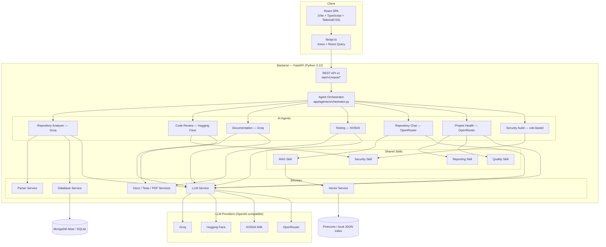
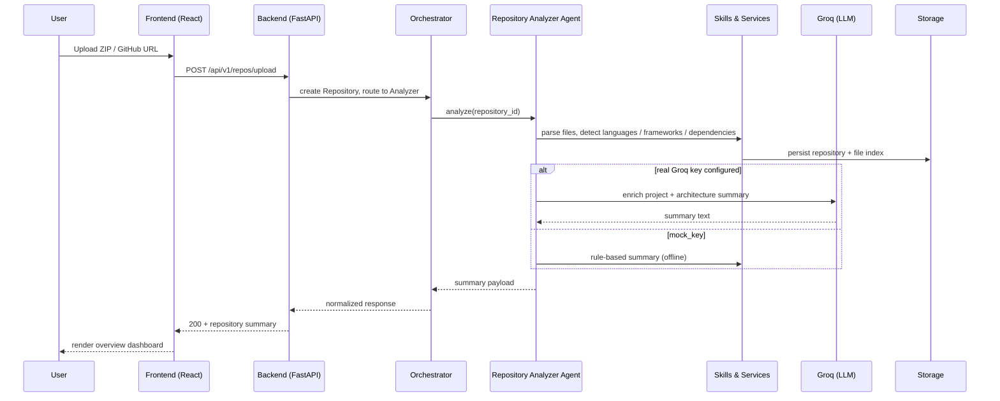
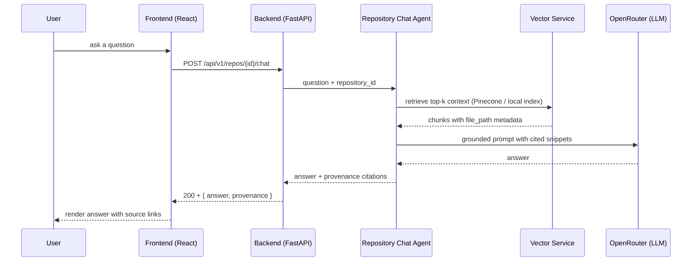

# DevPilot AI Architecture

## 1. Project Alignment

DevPilot AI is a production-grade SaaS platform for developer productivity. It is built around:
- AI-powered repository analysis
- Code review
- Documentation generation
- Test generation
- Repository contextual chat
- Project health monitoring

The platform is intentionally not a generic chat interface. It is a workflow-centric developer tool that integrates repository understanding, AI agents, and structured product dashboards.

## 2. Architecture Principles

- Modular service-oriented architecture
- Single Responsibility Principle for agents and services
- Low coupling, high cohesion
- Reusable shared skills and infrastructure
- Clear separation between frontend, backend, agents, skills, services, and storage
- Extendable design for Day-2 twists or additional AI agents

## 3. High-Level System Architecture



### 3.1 Frontend

- React + Vite + TypeScript + TailwindCSS
- React Router for page navigation
- Axios for API calls
- React Query for caching and asynchronous state management
- Dashboard-first UI with strong developer ergonomics

### 3.2 Backend

- FastAPI for HTTP API and orchestration
- Pydantic for request/response validation
- SQLAlchemy for persistence
- JWT Authentication; GitHub OAuth optional for time permitting
- Agent orchestrator layer routes requests to specialized AI agents

### 3.3 AI Layer

- Seven specialized agents:
  1. Repository Analyzer Agent → Groq
  2. Code Review Agent → Hugging Face
  3. Documentation Agent → Groq
  4. Testing Agent → NVIDIA
  5. Repository Chat Agent → OpenRouter
  6. Project Health Agent → OpenRouter
  7. Security Audit Agent (rule-based)
- One orchestrator controls routing and request validation
- Agents never communicate directly with each other
- Shared skills provide common logic and data access
- A provider registry (`backend/app/core/providers.py`) binds each agent to an
  OpenAI-compatible LLM endpoint; missing keys degrade gracefully to a
  single fallback key (`AI_API_KEY`)

### 3.4 Shared Skills and Services

Shared skills are reusable domain modules consumed by agents.

- GitHub Skill
- Repository Parser Skill
- LLM Skill
- Embedding Skill
- RAG Skill
- Reporting Skill
- Testing Skill

Shared services implement stable infrastructure abstractions.

- GitHub Service
- Parser Service
- Embedding Service
- Vector Service
- LLM Service
- Database Service
- Documentation Service
- Testing Service

## 4. Folder Structure

```
frontend/
  src/
    components/
    pages/
    routes/
    lib/
    hooks/
backend/
  app/
    api/
      v1/
    agents/
    skills/
    services/
    database/
    schemas/
    core/
    prompts/
    utils/
    main.py
  tests/
    unit/
    integration/
  scripts/

docs/
  ARCHITECTURE.md
  ROADMAP.md
  API_CONTRACTS.md
  RELEASE_PLAN.md

.github/
  workflows/
    ci.yml
    cd.yml

README.md
```

## 5. Module Definitions and Ownership

### 5.1 Frontend Modules

- `pages/` - feature pages such as Dashboard, Repository, Review, Docs, Tests, Chat, Settings
- `components/` - shared UI building blocks and domain-specific cards/widgets
- `routes/` - route definitions and protected route wrappers
- `lib/` - API client, auth helpers, query hooks, feature flags
- `hooks/` - custom React hooks for notifications, form state, and polling

### 5.2 Backend Modules

- `api/v1/` - endpoint controllers layering request validation and orchestration
- `agents/` - specialized AI agent implementations
- `skills/` - reusable logic for shared domain capabilities
- `services/` - infrastructure and external integration logic
- `database/` - MongoDB Atlas backend + SQLAlchemy fallback, session management, repository pattern, models
- `schemas/` - Pydantic request/response schemas
- `core/` - app startup, settings/config, logging, exception handling, security
- `prompts/` - reusable prompt templates for agents
- `utils/` - shared helpers

### 5.3 Agent Responsibilities

- `Repository Analyzer Agent`
  - Analyze repository structure, languages, frameworks, dependencies
  - Generate project summary and architecture summary

- `Code Review Agent`
  - Review code files for correctness, maintainability, security, performance
  - Suggest improvements and surface bug patterns

- `Documentation Agent`
  - Create README, API docs, architecture docs, installation guides, changelog drafts

- `Testing Agent`
  - Create unit tests, integration tests, edge case coverage, mock data suggestions

- `Repository Chat Agent`
  - Contextual chat over repository using RAG
  - Explain files, functions, architecture, and find code locations
  - Avoid hallucinations by using embeddings and source provenance

- `Project Health Agent`
  - Compute health metrics: documentation, testing, security, maintainability, complexity, overall score

### 5.4 Shared Services Ownership

- `GitHub Service` - repo ingestion, repo metadata, optional OAuth
- `Parser Service` - repository file parsing, AST extraction, dependency graph
- `Embedding Service` - text embedding generation and storage
- `Vector Service` - Pinecone operations for RAG retrieval (local JSON index fallback)
- `LLM Service` - OpenAI-compatible chat client driving Groq, Hugging Face, Mistral, NVIDIA, and OpenRouter endpoints
- `Database Service` - persistence layer and repository pattern
- `Documentation Service` - generation, templating, formatting
- `Testing Service` - test case scaffolding and coverage analysis

## 6. API Design

### Core API endpoints

- `POST /api/v1/repos/upload` - upload repository archive or provide GitHub URL
- `POST /api/v1/repos/{repo_id}/analyze` - trigger repository analysis
- `GET /api/v1/repos/{repo_id}` - fetch repository summary and metadata
- `POST /api/v1/repos/{repo_id}/code-review` - run code review on target files or entire repo
- `POST /api/v1/repos/{repo_id}/documentation` - generate docs artifacts
- `POST /api/v1/repos/{repo_id}/tests` - generate unit/integration tests
- `POST /api/v1/repos/{repo_id}/chat` - repository QA chat endpoint
- `GET /api/v1/repos/{repo_id}/files` - list indexed file metadata
- `GET /api/v1/repos/{repo_id}/files/content?path=...` - fetch raw file content for preview
- `GET /api/v1/repos/{repo_id}/health` - get project health dashboard data
- `GET /api/v1/repos/{repo_id}/status` - current analysis task state

### Request/Response contract patterns

- Use Pydantic models for request body validation
- Return structured responses with `status`, `data`, and `errors`
- Include provenance metadata for RAG answers
- Support pagination for large file listings

## 7. Database Schema

### Entities

- `User`
  - id, email, name, github_id, auth_provider, created_at

- `Repository`
  - id, user_id, name, source_url, status, primary_language, framework, created_at, updated_at

- `RepositoryFile`
  - id, repository_id, file_path, language, file_type, checksum, created_at

- `AnalysisReport`
  - id, repository_id, report_type, summary, details, created_at

- `HealthMetric`
  - id, repository_id, documentation_score, testing_score, security_score, maintainability_score, complexity_score, overall_score, updated_at

- `ChatSession`
  - id, repository_id, user_id, session_name, created_at

- `ChatMessage`
  - id, chat_session_id, sender, text, response, provenance, created_at

- `EmbeddingRecord`
  - id, repository_id, source_type, source_id, text, vector_id, created_at

### Notes

- Health scores are derived and stored separately from raw analysis
- Embedding records are persisted for RAG and can be invalidated when repo content changes

## 8. UI Navigation

### Pages

- Dashboard
  - repository overview
  - health snapshot
  - recent activity

- Repository Workspace
  - repository summary
  - architecture summary
  - file list and metadata

- Code Review
  - targeted review, file-level feedback, suggestions

- Documentation
  - README generator
  - API docs generator
  - architecture and installation docs
  - changelog drafts

- Tests
  - unit/integration test generation
  - edge case proposals
  - mock data preview

- Chat
  - contextual QA powered by repository embeddings
  - source-linked answers

- Project Health
  - scorecards for documentation, tests, security, maintainability, complexity
  - health recommendations

### Navigation Model

- Left sidebar with primary routes
- Top header with repo selector and quick actions
- Card-based dashboard summaries
- Modal workflows for repo upload / analysis tasks

## 9. Communication and Data Flow

1. User initiates action in frontend
2. Frontend sends HTTP request to backend API
3. Backend controller validates request and routes through orchestrator
4. Orchestrator selects matching agent for the task
5. Agent calls shared skills/services as needed
6. Shared services access database, parser, embeddings, and external AI services
7. Pinecone retrieves context for chat/RAG tasks (local vector index when offline)
8. Agent returns structured response to orchestrator
9. Backend sends normalized response to frontend

### 9.1 End-to-end repository analysis (sequence)



### 9.2 Repository QA chat with provenance (sequence)



## 10. Implementation Roadmap

### Milestone 1: Core architecture and platform foundation
- Define folder structure and module contracts
- Initialize backend project structure and core API layer
- Initialize frontend scaffold and UI navigation skeleton
- Create architecture and product documentation

### Milestone 2: Repository ingestion and analyzer
- Implement repo upload and GitHub source handling
- Build repository parser service and analyzer agent
- Materialize repository summary and architecture summary
- Save repo metadata and file index to database

### Milestone 3: Project health dashboard
- Implement health metric computation and dashboard API
- Display documentation, testing, security, maintainability, complexity scores
- Generate overall health score

### Milestone 4: Documentation and testing agents
- Implement documentation generation pipelines
- Implement test generation pipelines
- Add support for README, API docs, installation guides, changelog, unit/integration tests

### Milestone 5: Code review and repository chat
- Implement code review agent with reusable LLM prompts
- Implement embedding store and RAG service
- Build repository chat interface with provenance tracking

### Milestone 6: Production polish, CI/CD, deployment
- Add JWT auth and optional GitHub OAuth
- Add logging, monitoring, error handling
- Write tests for backend and frontend
- Add GitHub Actions CI workflow and deployment config

## 11. Risk Analysis and Bottlenecks

### Risks
- Overloading a single monolithic AI assistant: mitigated by specialized agents and orchestrator
- Hallucinations in repo chat: mitigated by RAG retrieval, embedding provenance, and source citations
- Poor performance on large repos: mitigated by incremental parsing, file filtering, and asynchronous task workflows
- Scope creep from hackathon feature budget: mitigated by prioritizing exact MVP features and modular design

### Bottlenecks
- Embedding storage and retrieval latency for repo chat
- LLM provider rate limits and prompt cost
- Parsing large repositories and dependency graphs
- Health score calibration and meaningful metrics

## 12. Scalability Plan

- Stateless backend API layer with database-backed persistence
- Separate vector store (Pinecone) for retrieval scaling
- Async task execution for expensive repo analysis and embedding generation
- Modular agents that can be extended or scaled horizontally
- Clear separation of frontend and backend deployment targets
- GitHub Actions CI for repeatable builds and test validation

## 13. Required Deliverables

- Product documentation and architecture docs in `docs/`
- Full folder structure and module definitions
- Clear API contract and data model definitions
- UI navigation and dashboard design principles
- Modular backend with specialized agents and shared services
- Production-ready approach, not prototype-level code
